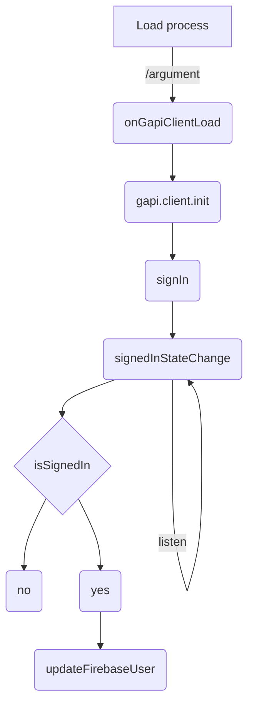
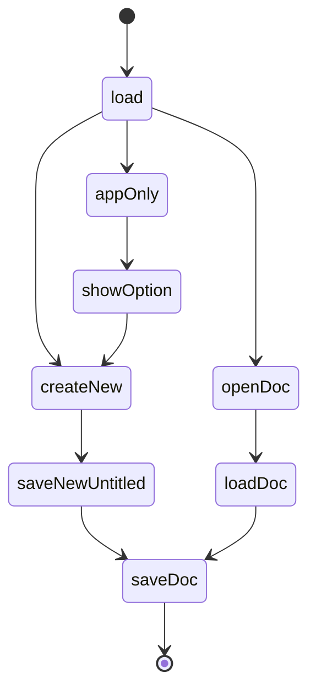

# Symthink

This project was generated using [Nx](https://nx.dev).

<p style="text-align: center;"></p>

🔎 **Smart, Extensible Build Framework**

## Adding capabilities to your workspace

Nx supports many plugins which add capabilities for developing different types of applications and different tools.

These capabilities include generating applications, libraries, etc as well as the devtools to test, and build projects as well.

Below are our core plugins:

- [React](https://reactjs.org)
  - `npm install --save-dev @nrwl/react`
- Web (no framework frontends)
  - `npm install --save-dev @nrwl/web`
- [Angular](https://angular.io)
  - `npm install --save-dev @nrwl/angular`
- [Nest](https://nestjs.com)
  - `npm install --save-dev @nrwl/nest`
- [Express](https://expressjs.com)
  - `npm install --save-dev @nrwl/express`
- [Node](https://nodejs.org)
  - `npm install --save-dev @nrwl/node`

There are also many [community plugins](https://nx.dev/community) you could add.

## Generate an application

Run `nx g @nrwl/react:app my-app` to generate an application.

> You can use any of the plugins above to generate applications as well.

When using Nx, you can create multiple applications and libraries in the same workspace.

## Generate a library

Run `nx g @nrwl/react:lib my-lib` to generate a library.

> You can also use any of the plugins above to generate libraries as well.

Libraries are shareable across libraries and applications. They can be imported from `@symthink/mylib`.

## Development server

Run `nx serve my-app` for a dev server. Navigate to http://localhost:4200/. The app will automatically reload if you change any of the source files.

## Code scaffolding

Run `nx g @nrwl/react:component my-component --project=my-app` to generate a new component.

## Build

Run `nx build my-app` to build the project. The build artifacts will be stored in the `dist/` directory. Use the `--prod` flag for a production build.

## Running unit tests

Run `nx test my-app` to execute the unit tests via [Jest](https://jestjs.io).

Run `nx affected:test` to execute the unit tests affected by a change.

## Running end-to-end tests

Run `ng e2e my-app` to execute the end-to-end tests via [Cypress](https://www.cypress.io).

Run `nx affected:e2e` to execute the end-to-end tests affected by a change.

## Understand your workspace

Run `nx dep-graph` to see a diagram of the dependencies of your projects.

## Further help

Visit the [Nx Documentation](https://nx.dev) to learn more.

## Assets

Generating logo sizes

```shell
ffmpeg -i logo-1257x1183.jpg -vf scale=256:256 logo_256x256.png
ffmpeg -i logo-1257x1183.jpg -vf scale=64:64 logo_64x64.png
ffmpeg -i logo-1257x1183.jpg -vf scale=16:16 logo_16x16.png

ffmpeg -i logo_square.jpeg -vf scale=128:128 logo_128x128.png
ffmpeg -i logo_square.jpeg -vf scale=32:32 logo_32x32.png
ffmpeg -i logo_square.jpeg -vf scale=96:96 logo_96x96.png
ffmpeg -i logo_square.jpeg -vf scale=48:48 logo_48x48.png
ffmpeg -i logo_square.jpeg -vf scale=64:64 logo_64x64.png
ffmpeg -i logo_square.jpeg -vf scale=256:256 logo_256x256.png
ffmpeg -i logo_square.jpeg -vf scale=16:16 logo_16x16.png

ffmpeg -i icon_132x132.png -vf scale=32:32 icon_32x32.png
ffmpeg -i icon_132x132.png -vf scale=16:16 icon_16x16.png
ffmpeg -i icon_132x132.png -vf scale=48:48 icon_48x48.png

ffmpeg -i logo-1854x1183.png -vf scale=220:140 logo_220x140.png
ffmpeg -i logo-1854x1183.png -vf scale=1280:800 screenshot_1280x800.png

```

## Flow Charts

```mermaidjs
graph TD
    A[SymThink.io] -->|authenticate| B
    B(Google Oath Consent) --> C{/argument}
    C -->|?new=1| D[Create/save new doc]
    C -->|?id=1234| E[load from gdrive]
```

## Drive API v3 references

Scopes: https://developers.google.com/identity/protocols/oauth2/scopes

https://www.googleapis.com/auth/drive.install
https://www.googleapis.com/auth/drive.file
https://www.googleapis.com/auth/cloud-language
https://www.googleapis.com/auth/drive.appdata -- maybe?

Uploading data: https://developers.google.com/drive/api/v3/manage-uploads#simple

response object from file.create

```json
{
  "kind": "drive#file",
  "id": "1ZVXOPxrzpNRKcv5xc6PXwGJrXDgJ7tMj",
  "name": "MyTestSymThinkdoc",
  "mimeType": "application/octet-stream"
}
```

### Authenicating

https://stackoverflow.com/questions/33361526/gapi-auth-authorize-with-immediate-true-is-not-working

https://developers.google.com/identity/protocols/oauth2/javascript-implicit-flow

New: https://symthink.io/argument/?state=%7B%22folderId%22:%220ALjTYrt2tPVgUk9PVA%22,%22action%22:%22create%22,%22userId%22:%22115074693555871811706%22,%22folderResourceKey%22:%22%22%7D&code=4/0AX4XfWiMLbMLpc0CJKtg0DlokzoHVLC_EEdxyOOoWhtT2jViWg0ciTEhQwyPQeOUhrhziw&scope=https://www.googleapis.com/auth/drive.appdata%20https://www.googleapis.com/auth/drive.file%20https://www.googleapis.com/auth/drive.install%20https://www.googleapis.com/auth/cloud-language

```json
{
  "folderId": "0ALjTYrt2tPVgUk9PVA",
  "action": "create",
  "userId": "115074693555871811706",
  "folderResourceKey": ""
}
```

Open: https://symthink.io/argument/?state=%7B%22ids%22:%5B%2217mgzgIqXcEh2INQOeOOHgPtMzBtbjyDS%22%5D,%22action%22:%22open%22,%22userId%22:%22115074693555871811706%22,%22resourceKeys%22:%7B%7D%7D&code=4/0AX4XfWgLGNTo-4ZkA8agwp7HpgcKykNSp7WwQjLYrNRM2sakzPZT7PGg45BgwGkS8kxpBg&scope=https://www.googleapis.com/auth/drive.appdata%20https://www.googleapis.com/auth/drive.file%20https://www.googleapis.com/auth/drive.install%20https://www.googleapis.com/auth/cloud-language

```json
state = {
  "ids": ["17mgzgIqXcEh2INQOeOOHgPtMzBtbjyDS"],
  "action": "open",
  "userId": "115074693555871811706",
  "resourceKeys": {}
}
```

code=4/0AX4XfWgLGNTo-4ZkA8agwp7HpgcKykNSp7WwQjLYrNRM2sakzPZT7PGg45BgwGkS8kxpBg
scope=https://www.googleapis.com/auth/drive.appdata%20https://www.googleapis.com/auth/drive.file%20https://www.googleapis.com/auth/drive.install%20https://www.googleapis.com/auth/cloud-language


### Authentication Process



### Post login doc initialization process




### Self sign cert for dev server

`openssl req -x509 -newkey rsa:4096 -keyout key.pem -out cert.pem -sha256 -days 365`

## Measuring productivity

* Count descendents of doc on every save 
and save total to doc metadata.  
* When a doc is closed, update app totals on a year/week number 1-52.
  * total cards in all docs, minus last week's total
  * calculate effort points for current week no#
* dailySt: objects representing each day of the week.


Log property: [WEEK NO#, TOTAL CARDS IN CURRENT WEEK, EFFORT POINTS FOR CURRENT WEEK]
```json
{
  "year": 2022,
  "weeklyStats": [[1,14,23],[2,16,20],[52,3,5]]
}
```


## Symthink Class Structure

Symthink: leaf
SymthinkDocument: root
PSymThink: has persistence in a cloud or local collection
-> GDriveSymthink
-> LocalSymthink


## Resources

* https://developers.google.com/identity/gsi/web/guides/client-library
* https://cdnjs.com/libraries/firebase
* https://icons.getbootstrap.com/
* https://icon-sets.iconify.design/
* [Adding authorized redirect URIs](https://console.cloud.google.com/apis/credentials/oauthclient/836033477453-9d1q872r0m755pvjmo49u4cea95v04bp.apps.googleusercontent.com?project=symthink-io)