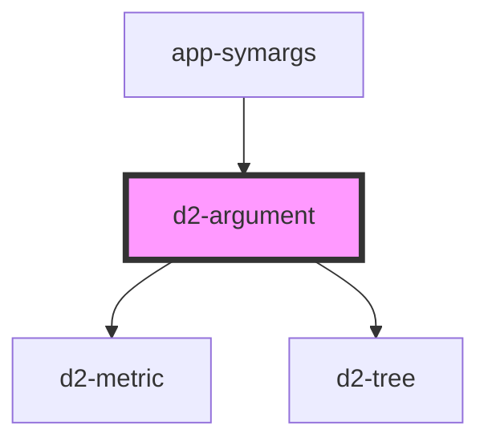

# d2-argument

## Icons

* Add a node: https://icons.getbootstrap.com/icons/node-plus/
* Edit: https://icons.getbootstrap.com/icons/pencil/  or https://www.toptal.com/designers/htmlarrows/symbols/lower-right-pencil/
* Fallacy: https://www.compart.com/en/unicode/U+2260
* Nudge: https://www.toptal.com/designers/htmlarrows/currency/

<!-- Auto Generated Below -->

## Properties

| Property  | Attribute  | Description | Type               | Default     |
| --------- | ---------- | ----------- | ------------------ | ----------- |
| `data`    | `data`     |             | `object \| string` | `undefined` |
| `dataUrl` | `data-url` |             | `string`           | `undefined` |
| `edit`    | `edit`     |             | `boolean`          | `undefined` |

## Events

| Event       | Description | Type                |
| ----------- | ----------- | ------------------- |
| `exitClick` |             | `CustomEvent<void>` |
| `moreClick` |             | `CustomEvent<void>` |

## Shadow Parts

| Part     | Description |
| -------- | ----------- |
| `"head"` |             |
| `"main"` |             |

## Dependencies

### Used by

 - [app-symargs](../app-symargs)

### Depends on

- [d2-metric](../d2-metric)
- [d2-tree](../d2-tree)

### Graph

----------------------------------------------

*Built with [StencilJS](https://stenciljs.com/)*
