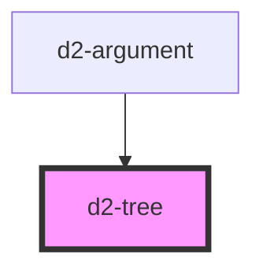

# d2-tree

<!-- Auto Generated Below -->

## Properties

| Property  | Attribute | Description | Type               | Default     |
| --------- | --------- | ----------- | ------------------ | ----------- |
| `current` | `current` |             | `string`           | `undefined` |
| `data`    | `data`    |             | `object \| string` | `undefined` |

## Events

| Event            | Description | Type                  |
| ---------------- | ----------- | --------------------- |
| `closeGoRequest` |             | `CustomEvent<string>` |

## Dependencies

### Used by

 - [d2-argument](../d2-argument)

### Graph

----------------------------------------------

*Built with [StencilJS](https://stenciljs.com/)*
